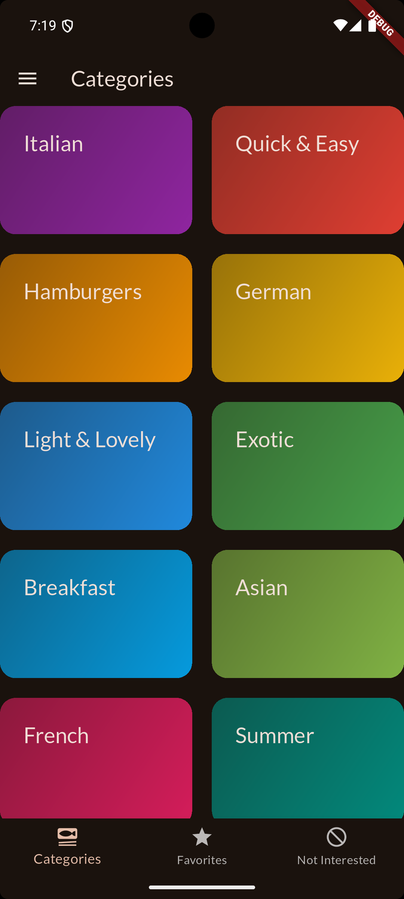
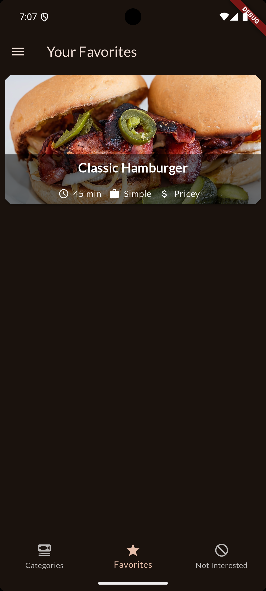

# meals

A new Flutter project.

## Getting Started

📌 Project Description: Meals App
Meals App is a beautifully designed Flutter application that allows users to explore, filter, and save their favorite meals. The app provides a rich user experience with smooth animations, a clean UI, and efficient state management using Riverpod.

🚀 Key Features:
✔ Browse a variety of meals with detailed descriptions and images.
✔ Filter meals based on dietary preferences (e.g., vegetarian, gluten-free).
✔ Save favorite meals for quick access.
✔ Smooth animations for a better user experience.
✔ Modern UI using Google Fonts and transparent images for a seamless look.

🛠️ Technologies & Skills Used:
✅ Flutter – Cross-platform mobile app development
✅ Dart – Programming language for Flutter
✅ State Management (Riverpod) – Efficient app state handling
✅ UI/UX Design – Using Google Fonts & Transparent Images
✅ Navigation & Routing – Managing multiple screens smoothly

## 📸 App Screenshots

<table>
  <tr>
    <td><b>Main Drawer</b></td>
    <td><b>Home</b></td>
    <td><b>Ingredient & Steps</b></td>
    <td><b>Foods list</b></td>
  </tr>
  
  <tr>
    <td></td>
    <td></td>
    <td></td>
    <td></td>
  </tr>
</table>

<table>
  <tr>
    <td><b>Favorite</b></td>
    <td><b>Not Interested</b></td>
  </tr>
  
  <tr>
    <td></td>
    <td></td>
  </tr>
</table>
